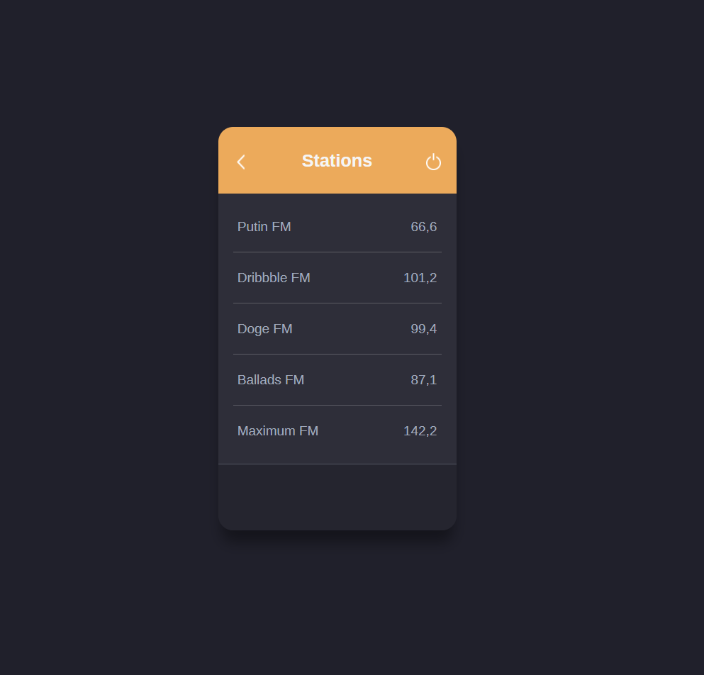
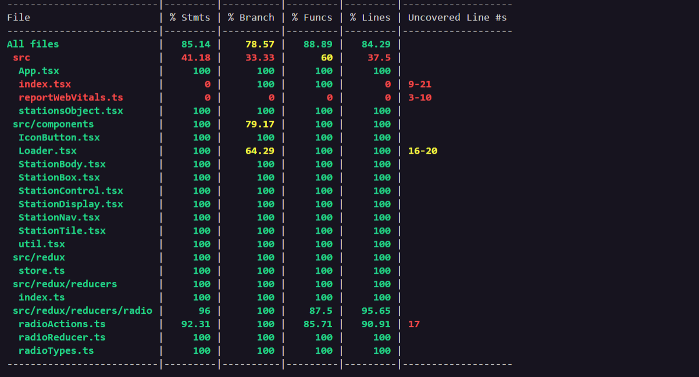

# Radio Widget

A React component to handle switching between radio stations.



Radio Widget is a React Component that manages radio stations. its is mostly static but can be very dynamic once connected to an Api endpoint and data is passed to the `StationBody` component using the `stations` props.

## Built With

- JavaScript, TypeScript, React
- Hooks, Redux, Redux thunk,
- Sass, Css modules.
- Jest, React-testing-library, Jest-axe

## Live Demo

[Live Demo Link](https://radio-widget-three.vercel.app/)

## Getting Started

To get a local copy up and running follow these simple example steps.

### Prerequisites

To run this project, you will need to have `node`,`npm`, `TypeScript` already installed locally

### Setup

`Clone the project and cd into the directory`

### Install

run `npm install` to install all the dependencies of the project

### Usage

run `npm start` to get the project running

open browser and navigate to `http://localhost:3000/`

- Widget is mostly static - selecting station is the only action available. After selecting station, it toggles the station and displays its name at the bottom of the widget

- The rest of the buttons are clickable but it will trigger no action.

### Running Tests

run `npm test` to get the tests running

#### Analysis report

Analysis Report shows


```bash

 85.14% Statements 63/7478.57% Branches 33/4288.89% Functions 24/2784.29% Lines 59/70

```

Analysis Report can be generated by running `npm test -- --coverage`

## Authors

👤 **Author**

- Github: [solomonakp](https://github.com/solomonakp)
- twitter: [@dev_chuck](https://twitter.com/dev_chuck)

## 🤝 Contributing

Contributions, issues and feature requests are welcome!

Feel free to check the [issues page](https://github.com/solomonakp/Conercase-task-/issues).

## Show your support

Give a ⭐️ if you like this project!

## 📝 License

This project is [MIT](lic.url) licensed.
